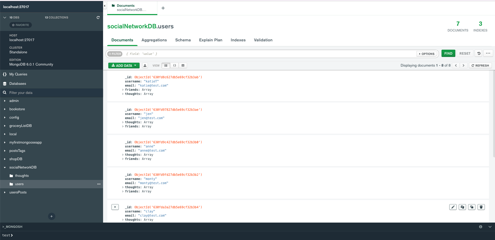
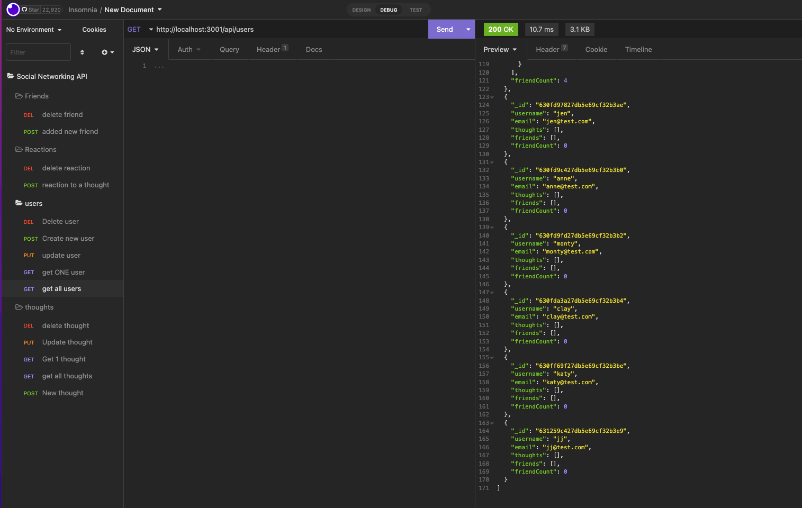

# Social-NetWorking-API

[](https://opensource.org/licenses/MIT)


## Description

This app utilizes mongoDB to create a ficticious social networking api. Since social networking uses lots of data, this api needs the flexibility of unstructured data that mongoDB, a NpSQL database, provides. 

The backend app allows users to share their thoughts, add friends, and react to others' thoughts using express.js for routing, mongoDB for the database, and Mongoose for the CRUD ODM structure using Javascript through Node.js.

## User Story

```md
AS A social media startup
I WANT an API for my social network that uses a NoSQL database
SO THAT my website can handle large amounts of unstructured data
```

<details>
<summary><strong>Table of Contents</strong></summary>

- [Social-NetWorking-API](#social-networking-api)
  - [Description](#description)
  - [User Story](#user-story)
  - [Installation](#installation)
  - [Usage](#usage)
  - [License](#license)
  - [Contributing Guidelines](#contributing-guidelines)
  - [Tests](#tests)
  - [Languages, Skills and Credits](#languages-skills-and-credits)
  - [Video walkthrough](#video-walkthrough)
  - [Questions and Links](#questions-and-links)
</details>


## Installation 
```
- clone the repository
- run npm init, then npm install to load all dependencies
```

## Usage
- From the root directory, type in "npm run start" or "nodemon" to start the server.
- Insomnia or Postman will be needed to test the endpoints since this is a backend application.


## License
Distributed under the **MIT** license.

## Contributing Guidelines
Contributions help our open source community to continue to evolve, and any contributions are greatly appreciated. If you have a suggestion that would improve this code please follow the directions below. I require that any and all changes adhere to the Code of Conduct outlined in the [Contributor Covenant](https://www.contributor-covenant.org/).

## Tests
There are currently no tests written for this application.

## Languages, Skills and Credits
- Javascript
- Node.js
- [Express](https://www.npmjs.com/package/express) is the webserver framework for Node.js.
- [Mongoose](https://www.npmjs.com/package/mongoose) for the ODM.
- [dotenv](https://www.npmjs.com/package/dotenv) is used to host credentials in the environment file if the creater wants to use the service. 

## Video walkthrough



- [Setting up and connecting to the database, quick look at MongoDB Compass](https://drive.google.com/file/d/1GDGx0pxXmScy6KQJeMol1VbdfMkgkj2u/view?usp=sharing)
- [users CRUD endpoints](https://drive.google.com/file/d/1tEpInBBDpP0lesNP9N59RoNktL0dhtTh/view?usp=sharing)
- [thoughts CRUD endpoints](https://drive.google.com/file/d/1pd48BiX4hBP_G9MT0eN67vlmIv6WYHIv/view?usp=sharing)
- [reactions CRUD endpoints](https://drive.google.com/file/d/1tEpInBBDpP0lesNP9N59RoNktL0dhtTh/view?usp=sharing)
- [friends CRUD endpoints](https://drive.google.com/file/d/1REoTuoxHATmUgtE8WrUJvgONHTsrUt-Y/view?usp=sharing)


## Questions and Links
[My Github repository](https://github.com/amccorkl/Social-Networking-API)
